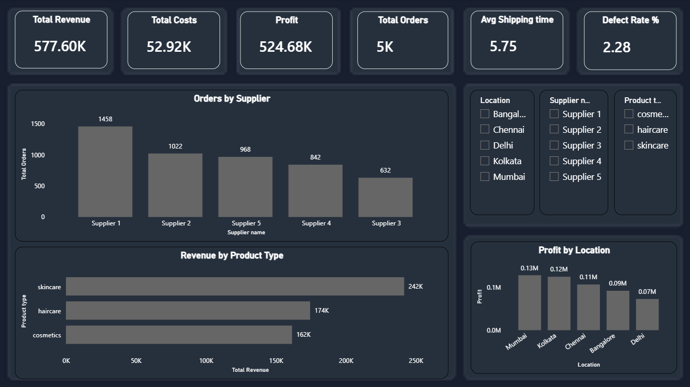
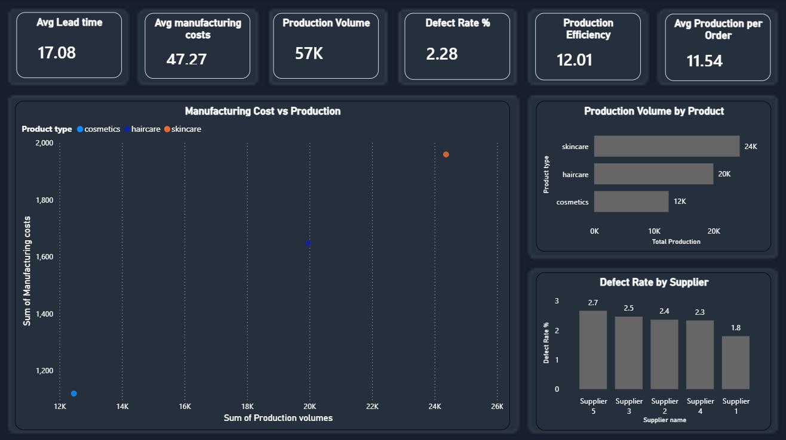
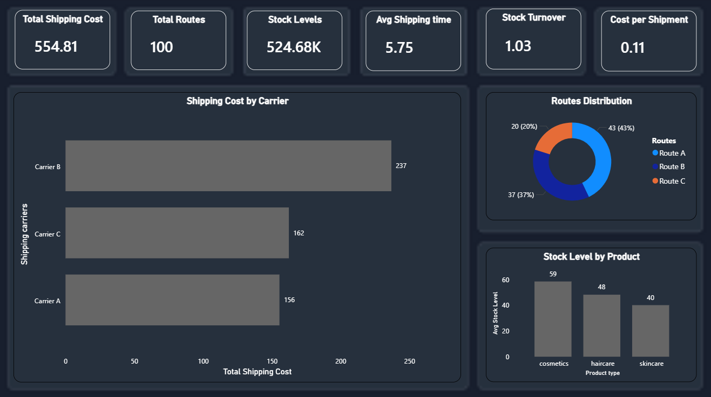

# 📊 Supply Chain Analysis Dashboard (Power BI)

## 📌 Overview

This project presents a comprehensive Supply Chain Analysis dashboard built using Power BI. It provides insights into operations, logistics, and business performance using real-world dataset.

## 🎯 Objectives

* Analyze revenue, cost, and profit
* Evaluate supplier performance
* Monitor production efficiency
* Optimize logistics and shipping operations

## 📊 Dashboard Pages

### 🟢 Overview

* Total Revenue, Profit, Orders
* Revenue by Product Type
* Profit by Location

### 🔵 Operations

* Production Volume Analysis
* Defect Rate by Supplier
* Manufacturing Cost vs Production
* Efficiency KPIs

### 🟠 Logistics

* Shipping Cost by Carrier
* Delivery Time Analysis
* Stock Level Monitoring
* Logistics KPIs

## 🛠 Tools Used

* Power BI
* DAX
* CSV Dataset

## 📂 Files

* `supply-chain.csv` → Dataset
* `Supply Chain Analysis.pbit` → Power BI Template

## 🚀 Key Insights

* Identified top-performing products contributing to revenue
* Detected suppliers with higher defect rates
* Analyzed cost variations across shipping carriers
* Improved visibility into logistics performance

## 👩‍💻 Author

Shruti Upadhyay
